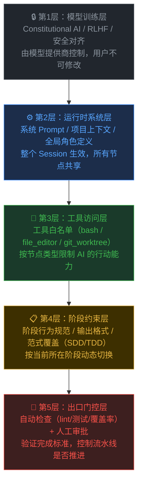
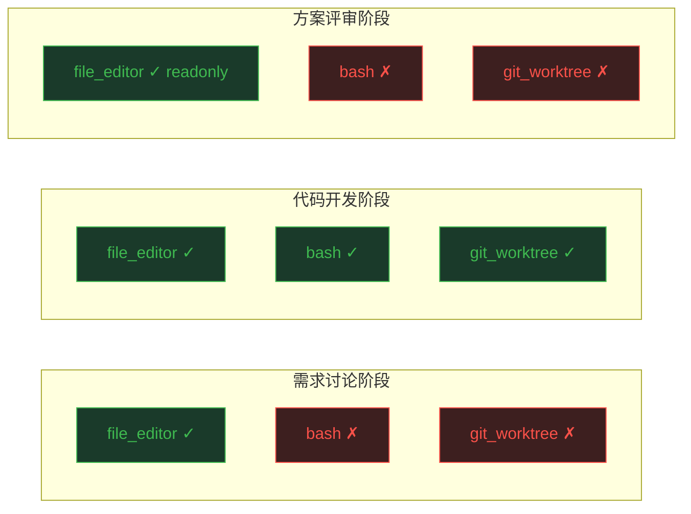
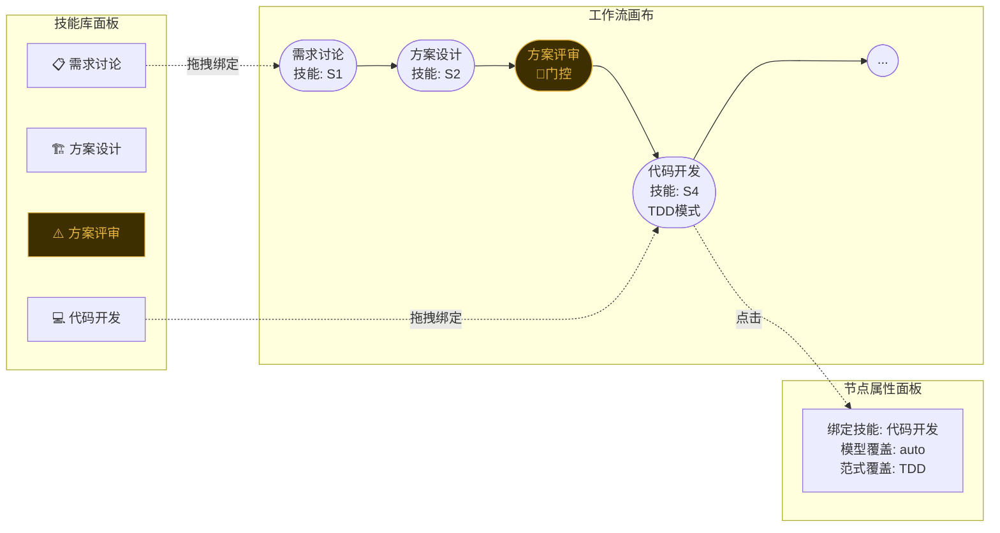
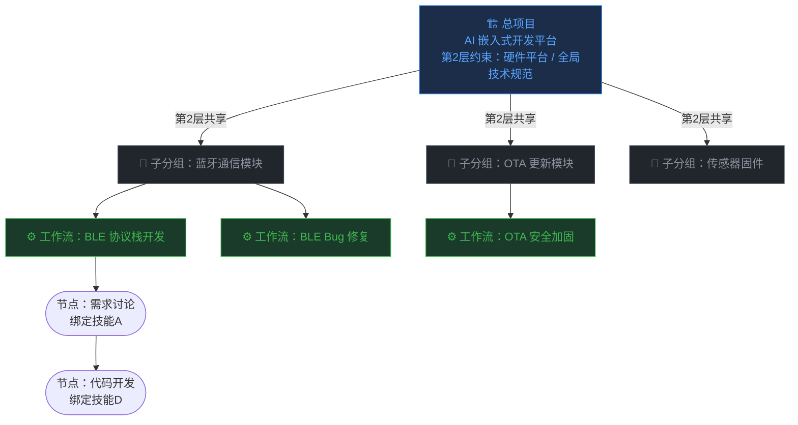
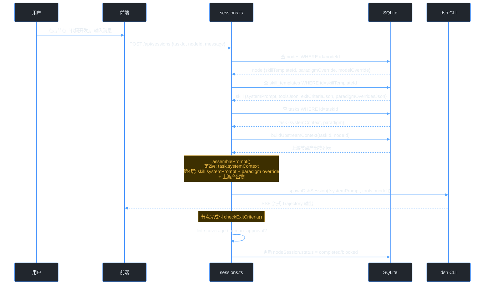
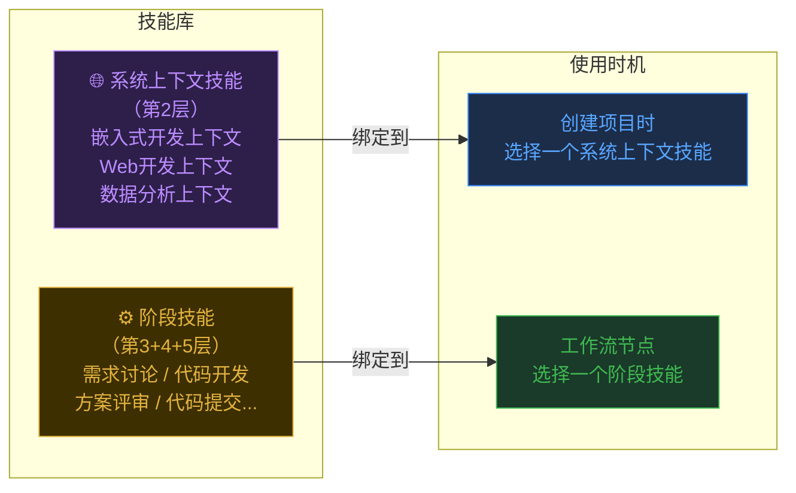
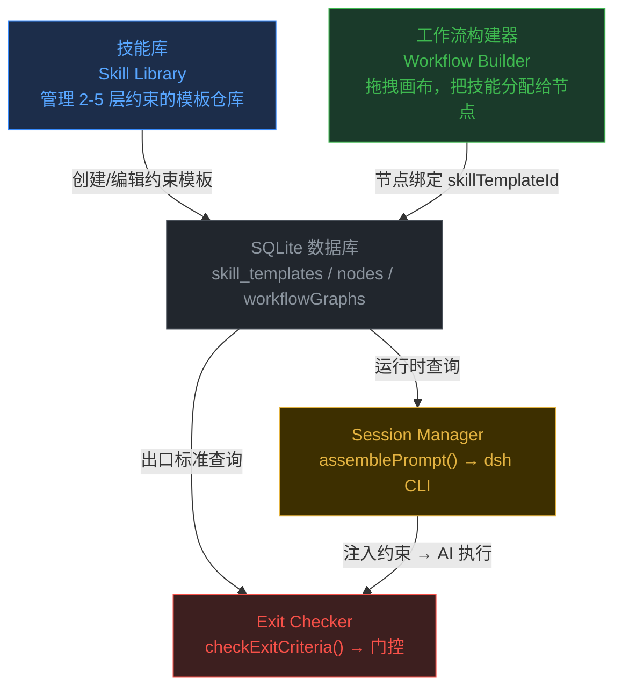

> 本文以一个真实在建的 AI 嵌入式开发协作平台为载体，从工程角度剖析 AI 约束的层次结构，并给出可直接实施的 UI 设计、数据库方案和代码框架。

## 背景：约束是让 AI 按标准工作的机制

AI 大模型本身没有"职业标准"——同一个模型，不加任何约束时会像一个百科全书，加了精确约束后才会像一个严格的嵌入式工程师。

**AI 约束**解决的核心问题：让初级工程师使用的 AI 按照高级工程师的工作标准输出结果。

本文讨论的平台具体场景：9 阶段嵌入式开发流水线，每个阶段的 AI 行为需要完全不同的约束（需求阶段禁止讨论实现细节，代码阶段强制 TDD，评审阶段只能标注不能修改）。

下图是平台的实际工作界面——选中任务后，9 个阶段节点在顶部流水线画布中展开，点击节点启动对应阶段的 AI 代理：


_平台实际 UI：选中「传感器固件 v2.0」任务后，工作流画布展示 9 个阶段节点_

---

## 一、AI 约束的 5 层架构



第 1 层由模型提供商固化，**第 2-5 层是平台可以管理和注入的部分**，也是本文的核心。

---

## 二、各层约束的具体内容（以平台为例）

### 第 2 层：运行时系统层

**书写时机：** 创建任务时，定义项目级角色和技术约束

**内容示例（嵌入式项目）：**

```
你是嵌入式开发 AI 助手，负责协助完成 STM32F4 传感器固件开发。

项目约束（必须遵守）：
- 硬件平台：STM32F4，ARM Cortex-M4，主频 168MHz，RAM 192KB
- HAL 层必须通过：应用层禁止直接操作寄存器
- 内存预算：单个模块堆栈使用不超过 4KB
- 编译器：GCC ARM 12，启用 -Wall -Wextra -Werror
```

**当前平台存放位置：** `CLAUDE.md`（本地文件，静态）
**改造目标：** 存入数据库 `tasks.system_context` 字段，UI 可编辑，按任务差异化配置

> **设计规则：第 2 层是创建任务的必填字段。** 没有第 2 层，节点的第 4 层约束（如"禁止直接操作硬件寄存器"）会失去技术上下文，AI 不知道这是什么项目、什么硬件平台。平台提供内置模板（嵌入式开发 / Web 开发 / 数据分析）降低填写门槛。

---

### 第 3 层：工具访问层

**核心价值：工具访问是比 Prompt 更可靠的约束**——即使 AI「想」执行危险操作，没有工具就无法执行。



---

### 第 4 层：阶段约束层（Harness YAML）

这是平台中最关键的约束层，9 个阶段 YAML 文件各自定义了一套行为规范。以「代码开发」为例：

```yaml
# plugins/harness/stage-05-code-dev.yaml
id: code-dev
model_default: qwen2.5:14b
system_prompt: |
  【阶段约束 - 代码开发】
  - 不得使用魔法数字：所有字面常量必须命名
  - 每个函数必须有单元测试（TDD 风格）
  - 禁止跨层调用：应用层不得直接操作硬件寄存器
  - 圈复杂度（CC）不得超过 10

tools: [bash, file_editor, git_worktree]

exit_criteria:
  lint: pass
  coverage: ">=80"

paradigm_overrides:
  tdd: "覆盖率目标提升至 90%，关键路径 100% 分支覆盖..."
```

**当前问题：** 这 9 个 YAML 文件已完整设计，但 `server/api/sessions.ts` 创建会话时**完全没有读取** `node.harnessPlugin` 字段——约束只是存在于文件里，并没有注入到 AI 执行过程中。

---

### 第 5 层：出口门控层

下图展示了平台实际的「工具与模型」面板，这里可以看到模型路由配置（第 3 层的一部分），但第 5 层的出口检查逻辑尚未实现：


_平台工具面板：本地模型（离线）与云端 claude-sonnet-4-6（806ms延迟），路由策略可切换_

---

## 三、存储方案选型

### 三种候选方案对比

| 维度 | 方案A：本地 YAML 文件（当前） | 方案B：SQLite 新表（推荐） | 方案C：独立配置服务 |
|------|------|------|------|
| **动态修改** | ❌ 需重新部署 | ✅ UI 实时修改 | ✅ UI 实时修改 |
| **版本管理** | ✅ Git 原生追踪 | ⚠️ 需手动实现 | ⚠️ 需手动实现 |
| **多节点复用** | ⚠️ 文件名耦合 | ✅ FK 关联 | ✅ API 调用 |
| **技术栈一致性** | ⚠️ 独立于主 DB | ✅ 同一 SQLite | ❌ 增加运维复杂度 |
| **UI 管理** | ❌ 无法在平台内管理 | ✅ 平台内 CRUD | ✅ 平台内 CRUD |
| **MVP 适合度** | ⚠️ 够用但有技术债 | ✅ 最适合 | ❌ 过度设计 |

**结论：选方案 B（SQLite 新增 `skill_templates` 表）**

理由：平台已用 SQLite + Drizzle ORM，零新依赖；UI 可直接 CRUD；多节点复用天然支持；MVP 阶段足够。

```typescript
// 推荐 Schema
export const skillTemplates = sqliteTable('skill_templates', {
  id: text('id').primaryKey(),
  name: text('name').notNull(),
  stageType: text('stage_type'),
  systemPrompt: text('system_prompt').notNull(),
  toolsJson: text('tools_json').notNull().default('[]'),
  exitCriteriaJson: text('exit_criteria_json').notNull().default('{}'),
  paradigmOverridesJson: text('paradigm_overrides_json').default('{}'),
  modelDefault: text('model_default').default('auto'),
  outputArtifact: text('output_artifact'),
  isBuiltin: integer('is_builtin', { mode: 'boolean' }).default(false),
  createdAt: integer('created_at', { mode: 'timestamp' }).notNull(),
  updatedAt: integer('updated_at', { mode: 'timestamp' }).notNull(),
})
```

---

## 四、UI 设计方案

### 技能库页面（约束管理中心）

技能库是第 2-5 层约束模板的统一管理入口。下图为设计原型，视觉风格与平台现有 UI 一致：


_技能库：紫色左边框 = 系统上下文技能（第2层，绑定到项目）；蓝色 = 内置阶段技能（第3/4/5层）；绿色 = 自定义；黄色 = 门控_

每张技能卡片展示：工具白名单（第 3 层）、出口条件（第 5 层）、模型配置。

### 技能编辑器（分层约束可视化编辑）

技能编辑器将 4 层约束在同一界面清晰呈现，左侧配置基本信息和工具权限，右侧分层编辑约束内容：


_阶段技能编辑器：不含第2层（第2层由项目选择的系统上下文技能提供）；右侧仅编辑第3层工具权限、第4层阶段约束、第5层出口门控_

### 工作流构建器（约束分配给节点）



---

## 五、任务层级与约束归属

真实项目不是一个任务对应一个工作流，而是有层级的——总项目下有多个子分组，每个子分组下有多个工作流：



**约束归属原则：**

| 层级 | 约束内容 | 作用范围 |
|------|---------|---------|
| 总项目 | 第 2 层：技术栈 / 硬件平台 / 全局规范 | 所有子分组、所有工作流共享 |
| 子分组 | 分组级共享资料：模块接口文档、模块规范 | 仅本分组内的工作流 |
| 工作流节点 | 第 3/4/5 层（技能）| 仅当前节点生效 |

---

## 六、运行时约束注入架构



### 核心组装函数（代码框架）

```typescript
// server/harness/prompt-assembler.ts — 当前缺失的核心函数
export async function assembleSessionPrompt(taskId: string, nodeId: string) {
  const [node] = await db.select().from(nodes).where(eq(nodes.id, nodeId))
  const [skill] = await db.select().from(skillTemplates)
    .where(eq(skillTemplates.id, node.skillTemplateId ?? ''))
  const [task] = await db.select().from(tasks).where(eq(tasks.id, taskId))
  const upstreamContext = await buildUpstreamContext(taskId, nodeId)

  // 第4层：叠加范式覆盖
  let stagePrompt = skill?.systemPrompt ?? '你是 AI 开发工作流助手。'
  const paradigm = node.paradigmOverride ?? task.paradigm ?? 'none'
  if (paradigm !== 'none' && skill?.paradigmOverridesJson) {
    const overrides = JSON.parse(skill.paradigmOverridesJson)
    if (overrides[paradigm]) stagePrompt += `\n\n${overrides[paradigm]}`
  }

  return {
    // 第2层 + 第4层 + 上游上下文
    systemPrompt: [task.systemContext, stagePrompt, upstreamContext].filter(Boolean).join('\n\n---\n\n'),
    // 第3层
    toolsJson: skill?.toolsJson ? JSON.parse(skill.toolsJson) : ['file_editor'],
    // 第5层
    exitCriteria: skill?.exitCriteriaJson ? JSON.parse(skill.exitCriteriaJson) : {},
  }
}
```

---

## 七、技能与约束的关系

技能不是独立于约束之外的东西，但不同层级的约束对应**不同类型的技能**。

### 技能库分为两种技能类型



**关键区别：**

| 技能类型 | 包含层级 | 绑定对象 | 编辑器内容 |
|---------|---------|---------|-----------|
| 系统上下文技能 | 仅第2层 | 项目/任务（必选一个）| 只有一个 system_prompt 文本框 |
| 阶段技能 | 第3+4+5层 | 工作流节点 | 工具勾选 + 阶段约束 + 出口门控 |

**阶段技能编辑器不含第2层**，因为第2层由项目创建时选择的系统上下文技能提供，和具体阶段无关。一个系统上下文技能可以被多个项目复用——定义一次"嵌入式开发上下文"，所有嵌入式项目共享。

**DB Schema 对应：**

```typescript
skillTemplates: {
  id, name,
  type: 'system_context' | 'stage',  // 区分两种技能类型
  systemPrompt: text,        // 两种类型都有（内容含义不同）
  toolsJson: text,           // 仅 stage 类型有效
  exitCriteriaJson: text,    // 仅 stage 类型有效
}

tasks: {
  systemContextSkillId: text  // FK → skill_templates（type='system_context'）
  // 替代原来的 systemContext: text（自由文本），改为从技能库选择
}
```

---

## 八、技能库与工作流构建器的关系



- **技能库 = 约束定义层**（写约束是什么）
- **工作流构建器 = 约束分配层**（决定哪个节点用哪个约束）
- **Session Manager = 约束注入层**（运行时把约束送进 AI）

三者合一，才构成完整的 AI 约束系统。

---

## 九、当前平台的改造路径

```mermaid
gantt
    title 约束系统改造路径
    dateFormat  X
    axisFormat %s

    section P0（2-3天）
    新增 skill_templates 表，迁移 9 个 YAML    :done, 0, 1
    sessions.ts 实现 assemblePrompt() 注入      :done, 1, 2

    section P1（1周）
    技能库 CRUD 页面（列表+编辑器）            :active, 2, 4
    exit-checker.ts 实现门控逻辑               :active, 3, 5

    section P2（2-3周）
    工作流构建器：拖拽 + 技能选择面板           :6, 9
    任务级 systemContext 字段 + 编辑 UI         :6, 7
```



| 优先级 | 改造项 | 工作量 | 核心收益 |
|--------|--------|--------|---------|
| **P0** | 新增 `skill_templates` 表，迁移 9 个 YAML | 小 | 解锁 UI 管理，为 P1 铺路 |
| **P0** | `sessions.ts` 实现 `assemblePrompt()`，接入约束注入 | 中 | **让约束真正生效** |
| P1 | 技能库 CRUD 页面 | 中 | 用户可创建自定义技能 |
| P1 | `exit-checker.ts` 实现门控逻辑 | 中 | 第5层开始工作 |
| P2 | 工作流构建器：拖拽 + 技能选择面板 | 大 | 可视化分配约束 |

**最小有效改造（P0 两项）：** 约 2-3 天工作量，即可让现有 9 个精心设计的约束真正在运行时生效。

---

## 十、项目知识库：消除重复 Token 消耗

### 问题

总项目下有多个子分组，每个子分组有多个工作流，所有工作流都需要了解项目的代码架构、接口定义、编码规范。如果每个节点都重新分析一遍原始代码：

- 10,000 行代码 → 每次分析 10,000+ tokens
- 10 个工作流 × 9 个节点 = 90 次重复分析
- **大量 token 消耗在"AI 已经知道"的事情上**

### 解决方案：预计算摘要，按需取用

```mermaid
flowchart TD
    subgraph 初始化（仅一次）
        CODE["原始代码\n10,000+ tokens"]
        ANALYZE["知识库构建任务\n分析一次，存结果"]
        SUMMARY["架构摘要 ~300 tokens\n接口摘要 ~200 tokens\n规范摘要 ~200 tokens"]
        CODE --> ANALYZE --> SUMMARY
    end

    subgraph 运行时（每次节点开会话）
        FETCH["assemblePrompt()"]
        INJ["注入摘要 ~700 tokens\n而非原始代码"]
        OD["按需拉取完整内容\n仅少数节点需要"]
    end

    SUMMARY -->|从 DB 读摘要| FETCH
    FETCH --> INJ
    FETCH -.节点声明需要时.-> OD

    style ANALYZE fill:#3d2f00,stroke:#e3b341,color:#e3b341
    style SUMMARY fill:#1a3a2a,stroke:#3fb950,color:#3fb950
    style INJ fill:#1a3a2a,stroke:#3fb950,color:#3fb950
    style OD fill:#1c2d4a,stroke:#388bfd,color:#58a6ff
```

### 数据库设计

```typescript
export const projectContext = sqliteTable('project_context', {
  id: text('id').primaryKey(),
  projectId: text('project_id').notNull(),
  groupId: text('group_id'),                   // 可选：绑定到子分组
  type: text('type').notNull(),                // 'architecture' | 'api_spec' | 'coding_standards'
  title: text('title').notNull(),
  summary: text('summary').notNull(),          // 预分析摘要，~300-500 tokens，始终注入
  fullContent: text('full_content'),           // 完整内容，按需拉取
  sourceFilePaths: text('source_file_paths'),  // 来源文件，变更时触发失效
  isStale: integer('is_stale', { mode: 'boolean' }).default(false),
  updatedAt: integer('updated_at', { mode: 'timestamp' }).notNull(),
})
```

### 注入策略（按层级按需）

```
assemblePrompt(taskId, nodeId)
├── 始终注入（约 800 tokens）
│   ├── task.system_context                    ← 第2层
│   └── project_context.architecture_summary  ← 架构摘要（预计算）
├── 按子分组注入（约 200 tokens）
│   └── group_context.module_summary           ← 当前模块共享资料
├── 按节点阶段注入（约 300 tokens）
│   └── skill.systemPrompt                     ← 第4层阶段约束
└── 按需拉取（节点声明需要时）
    └── project_context.fullContent            ← 某接口的完整定义
```

### Token 消耗对比

| 场景 | 单次节点 | 10 工作流 × 9 节点 |
|------|---------|-----------------|
| 重新分析原始代码 | ~10,000 tokens | ~900,000 tokens |
| 注入预计算摘要 | ~800 tokens | ~72,000 tokens |
| **节省** | **92%** | **828,000 tokens** |

### 失效与更新

```
代码文件变更时：
  markStale(project_context WHERE source_file_paths 包含变更文件)

节点开会话时：
  if project_context.is_stale:
    重新分析 → 更新 summary → is_stale = false    ← 唯一需要大 token 的时刻
  else:
    直接读缓存摘要（零分析消耗）
```

**知识库是项目级共享资产——工作流只是"按需借阅"，不是"每次重新研究"。**

---

## 总结

AI 约束不是一句 Prompt 能解决的问题，它是一个需要分层管理的系统工程：

- **第2层（系统层）** 决定 AI 的"职业身份"——它是谁，在什么项目里工作（任务级必填）
- **第3层（工具层）** 决定 AI 能做什么操作——比 Prompt 更可靠的行为边界
- **第4层（阶段层）** 决定 AI 在当前这个任务阶段的具体标准——核心的约束密度
- **第5层（门控层）** 决定 AI 什么时候才算"完成"——防止 AI 自行定义完成标准

| 问题 | 答案 |
|------|------|
| 技能和约束是什么关系？ | 技能库分两类：系统上下文技能（第2层）绑定到项目；阶段技能（第3/4/5层）绑定到节点 |
| 第 2 层归属哪里？ | 任务级（项目级），创建任务时必填，所有工作流共享 |
| 独立会话如何注入第 2 层？ | 每次开会话从 DB 实时读取，DB 是跨会话的"记忆" |
| 多工作流重复分析怎么解决？ | 项目知识库预计算摘要，注入摘要而不是原始代码，节省 ~92% token |

**技能库和工作流构建器，本质上就是这套约束系统的可视化管理界面。** 当约束从本地文件迁移到数据库、从静态配置变成动态注入、从重复分析变成预计算复用，平台就完成了从"有约束设计"到"约束真正高效驱动 AI 行为"的关键跨越。
